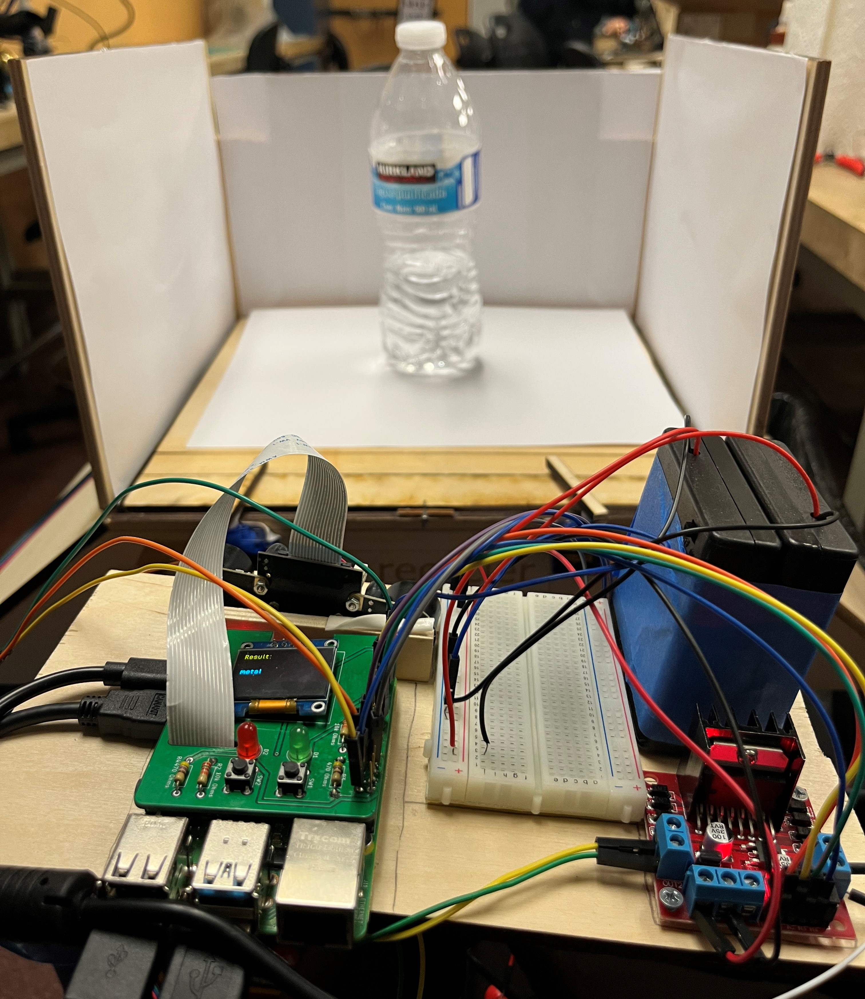

<h1 align="center">Re-Recycle (Object Detection)</h1>

  

	<a href="https://drive.google.com/file/d/1vMk5w3I8OSNKYPxmU-8SyktwbAC_AjER/view"><b>View Demo</b></a> 
	<a href="https://ece-re-recycler.web.app/"><b>Project Website</b></a>

  

  

  <figure>

  <figcaption>Model of Re-Recycler</figcaption>
</figure>

  <h2 align="center">Project Description </h2>

The project uese a Machine Learning model trained in Lobe to identify whether an object goes in the garbage or recylining. 
The goal of this project is to make a cover that segregates trashes into recyclable and non-recylcable.
	 

<h2 align="center">Contact</h2>

Jieun Lee 
 

